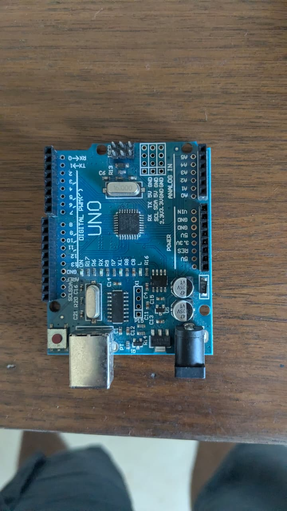
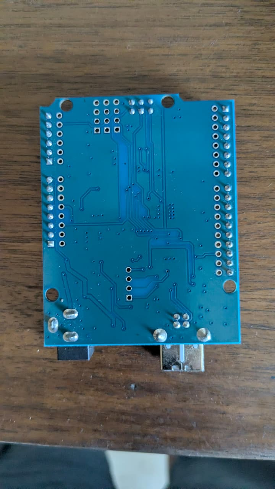

# Arduino Uno R3 Clone (ATmega328P + CH340G)

## Overview
You own a **blue PCB Arduino Uno R3 compatible board**. It's a third-party clone that uses the **CH340G USB-to-serial chip** instead of the official ATmega16U2. It's fully compatible with the Arduino ecosystem — same pinout, same programming, same shield compatibility. The main microcontroller is an **ATmega328P** in TQFP SMD package.

## Images
- 
- 

## Core Specifications
| Parameter | Value |
|-----------|-------|
| **Microcontroller** | ATmega328P (8-bit AVR, TQFP SMD package) |
| **USB-to-Serial** | CH340G (instead of official ATmega16U2) |
| **Operating Voltage** | 5V |
| **Input Voltage (recommended)** | 7–12V (via DC barrel jack) |
| **Input Voltage (limit)** | 6–20V |
| **CPU Speed** | 16 MHz |
| **Flash Memory** | 32 KB (0.5 KB used by bootloader) |
| **SRAM** | 2 KB |
| **EEPROM** | 1 KB |
| **DC Current per I/O Pin** | 20 mA (max 40 mA per pin) |
| **DC Current for 3.3V Pin** | 50 mA |

## Pinout Diagram
```
                       ┌───────────────────────────┐
                       │   USB-B   │  DC Jack      │
                       │   Port    │  7-12V In     │
   ┌───────────────────┤           │               │
   │    ICSP (top)     └───────────┴───────────────┘
   │    MISO ● ● VCC                ┌──┐
   │    SCK  ● ● MOSI               │R │
   │    RESET ● ● GND               │E │
   │                                │S │
   │  ┌─────────────────────────────┤E │
   │  │   ATmega328P (SMD TQFP)    │T │
   │  │                             │  │
   │  └─────────────────────────────┘  │
   │                                   │
   │  ┌─────────────────────────────┐  │
   │  │    CH340G USB-Serial Chip  │  │
   │  │    + 16MHz Crystal         │  │
   │  └─────────────────────────────┘  │
   │                                   │
   ├───────────────────────────────────┤
   │          POWER SECTION            │
   │  IOREF  RESET  3.3V  5V  GND VIN │  ← Power header
   ├───────────────────────────────────┤
   │          ANALOG IN               │
   │  A0   A1   A2   A3   A4(SDA) A5(SCL) │
   ├───────────────────────────────────┤
   │  D0/RX  D1/TX  D2  D3~  D4  D5~ │
   │  D6~    D7     D8  D9~  D10~  D11~│
   │  D12    D13(LED) GND  AREF       │
   └───────────────────────────────────┘
```

## Pin Functions Detail

### Digital I/O (Pins D0–D13)
| Pin | Function | Special |
|-----|----------|---------|
| D0 | RX | Serial receive (UART) |
| D1 | TX | Serial transmit (UART) |
| D2 | INT0 | External interrupt 0 |
| D3 | INT1 / PWM | External interrupt 1, PWM output |
| D4 | — | — |
| D5 | PWM | PWM output |
| D6 | PWM | PWM output |
| D7 | — | — |
| D8 | — | — |
| D9 | PWM | PWM output |
| D10 | SS / PWM | SPI Slave Select, PWM |
| D11 | MOSI / PWM | SPI Master Out Slave In, PWM |
| D12 | MISO | SPI Master In Slave Out |
| D13 | SCK / LED | SPI Clock, built-in LED (pin 13) |

### Analog Input (Pins A0–A5)
| Pin | Digital Alias | Special |
|-----|--------------|---------|
| A0 | D14 | — |
| A1 | D15 | — |
| A2 | D16 | — |
| A3 | D17 | — |
| A4 | D18 | I²C SDA |
| A5 | D19 | I²C SCL |

### Power Pins
| Pin | Voltage | Notes |
|-----|---------|-------|
| **VIN** | 7–12V | Input from DC jack also feeds here |
| **5V** | 5V | Regulated 5V output (or input via USB) |
| **3.3V** | 3.3V | From onboard regulator, max 50mA |
| **GND** | 0V | Ground reference |
| **IOREF** | 5V | Reference voltage for shields (indicates board logic level) |
| **RESET** | — | Reset (active low) |

## Key ICs on the Board

| Chip | Role | Details |
|------|------|---------|
| **ATmega328P** | Main microcontroller | 8-bit AVR, 32KB flash, 2KB SRAM, 16 MHz |
| **CH340G** | USB-to-serial converter | Converts USB to UART for programming. **Requires CH340 driver** on Windows (not auto-detected) |
| **LM1117-5.0** | 5V voltage regulator | Converts VIN (7–12V) to regulated 5V |
| **LM1117-3.3** | 3.3V voltage regulator | Converts 5V to 3.3V (max 50mA output) |
| **16 MHz crystal** | Main clock | Drives the ATmega328P at 16 MHz |
| **Power MOSFET** | Reverse polarity protection | Protects the board if power is connected backwards |

## Onboard LEDs
| LED | Pin | Color | Indication |
|-----|-----|-------|------------|
| **L** | D13 | Orange/Yellow | Connected to digital pin 13 — blinks in "Blink" sketch |
| **TX** | — | Green | Flashes when data is transmitted from Arduino to PC |
| **RX** | — | Green | Flashes when data is received by Arduino from PC |
| **ON** | — | Green | Power indicator — lit when board is powered |

## Clone-Specific Details (vs Official Arduino)

| Feature | This Board (Clone) | Official Arduino Uno R3 |
|---------|-------------------|------------------------|
| **USB chip** | CH340G | ATmega16U2 |
| **CPU package** | SMD (TQFP) | DIP (through-hole) — socketed |
| **PCB color** | Blue | Teal/dark blue |
| **Extra pads** | Yes (row of soldering points next to headers) | No |
| **Cost** | Cheap (~$3–5) | Expensive (~$25–30) |
| **Driver needed** | CH340 driver (separate install) | Native (no driver needed on most OS) |

## CH340G Driver Installation

### Windows (you're on Windows 10)
1. Download CH340 driver from: https://www.wch.cn/download/CH341SER_EXE.html
2. Run the installer
3. Connect the Arduino — it should appear as `COM3` or similar in Device Manager
4. In Arduino IDE: **Tools → Port → Select the COM port**

## What Can You Do With This?

### 1. Learn Arduino Programming (Ideal for Beginners)
The Arduino ecosystem has the largest learning community in electronics:
- Thousands of tutorials and example sketches
- Libraries for almost every sensor and module
- Simple C++ programming environment

### 2. Sensor Reading & Data Logging
| Sensor | Interface | Library |
|--------|-----------|---------|
| DHT22 (temp/humidity) | Digital (D2) | `DHT.h` |
| HC-SR04 (ultrasonic) | Digital (Trig/Echo) | `NewPing.h` |
| PIR motion | Digital (D2) | Simple digital read |
| Photoresistor (LDR) | Analog (A0) | `analogRead()` |
| Soil moisture | Analog (A0) | `analogRead()` |

### 3. Actuator Control
| Actuator | Connection | Notes |
|----------|-----------|-------|
| Servo motor | PWM pin (D9/D10) | Use `Servo.h` library |
| DC motor | Motor driver (L298N) | Use PWM for speed control |
| Stepper motor | ULN2003 driver | Use `Stepper.h` library |
| Relay module | Digital pin (D2–D13) | Simple `digitalWrite()` |
| RGB LED | PWM pins (3x) | Use `analogWrite()` for color mixing |

### 4. I²C / SPI Communication
| Protocol | Pins | Devices |
|----------|------|---------|
| **I²C** | A4 (SDA), A5 (SCL) | OLED display, BME280, MPU6050, LCD with I²C backpack |
| **SPI** | D10 (SS), D11 (MOSI), D12 (MISO), D13 (SCK) | SD card, RFID-RC522, ILI9341 TFT display |
| **UART** | D0 (RX), D1 (TX) | GPS module, Bluetooth module (HC-05), serial LCD |

### 5. Home Automation
- **Smart switch** — Arduino + relay + buttons
- **Light sensor + auto lamp** — LDR + relay
- **Motion-activated light** — PIR + relay
- **Temperature-controlled fan** — DHT22 + relay

### 6. Education & Prototyping
- The Arduino is the **best teaching tool** for embedded systems
- Test circuit concepts on Arduino before porting to ESP32 for production
- Great for **first-year engineering** or **BTP** course projects

## Comparison: Arduino Uno vs ESP32

| Aspect | Arduino Uno R3 | ESP32 |
|--------|---------------|-------|
| **CPU** | 8-bit, 16 MHz | Dual-core 32-bit, 240 MHz |
| **RAM** | 2 KB | 520 KB |
| **Wi-Fi/BT** | No | Yes (built-in) |
| **I/O Pins** | 14 digital, 6 analog | 25 GPIO, 18 ADC channels |
| **Analog** | 10-bit (0–1023) | 12-bit (0–4095) |
| **5V tolerance** | Yes | **NO** (3.3V only) |
| **Ease of use** | Very easy (beginner-friendly) | Moderate |
| **Power consumption** | ~50mA | ~80mA (Wi-Fi on) |
| **Best for** | Simple sensors, learning, shields | IoT, complex projects, connectivity |

## What You Need (Driver)
- **CH340 driver** must be installed on Windows before the board will be detected
- Download from: https://www.wch.cn/download/CH341SER_EXE.html
- After install: connect board → check COM port in Device Manager (Ports section)

## What You Might Want to Buy
| Item | Use |
|------|-----|
| **USB Type-B cable** | For programming — make sure it's a data cable, not charge-only |
| **Breadboard jumper wires** | You have these! |
| **Sensor modules** | DHT22, HC-SR04, PIR — great Arduino starter sensors |
| **Arduino starter kit** | Includes LEDs, resistors, sensors, and a guidebook |
| **9V battery clip + battery** | For standalone (non-USB) operation |
| **Shield (Ethernet, motor driver, relay)** | Plug-in expansion boards for the Uno |