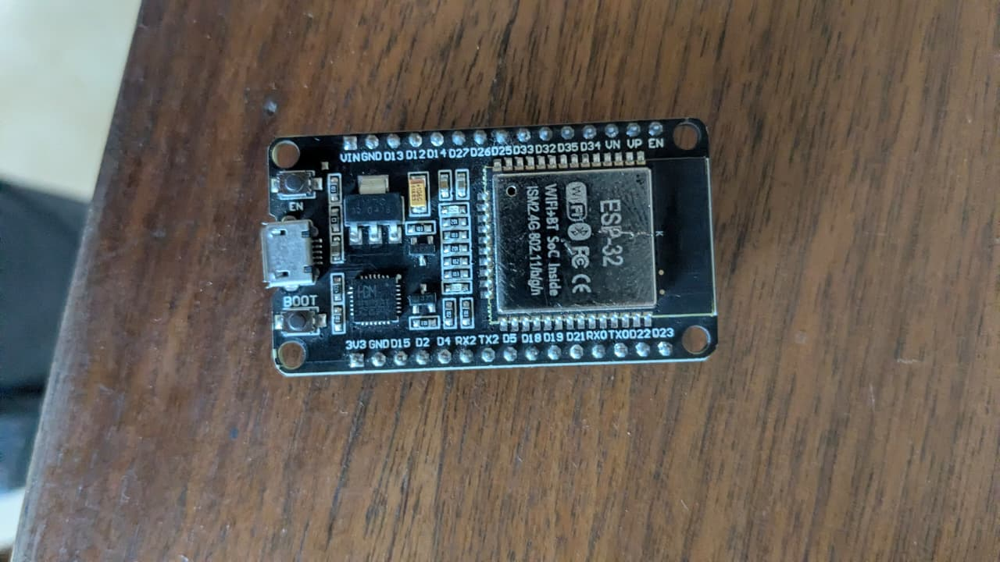
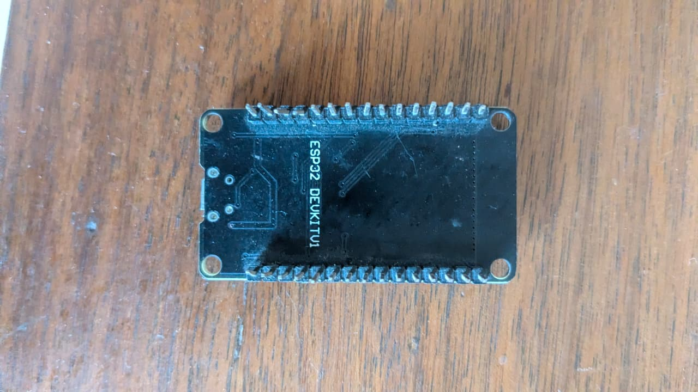

# ESP32 Development Board (30-Pin, ESP-WROOM-32)

## Overview
You own a **30-pin ESP32 DevKit V1 development board** based on the **ESP-WROOM-32** module. This is a powerful dual-core microcontroller with built-in **Wi-Fi (802.11 b/g/n)** and **Bluetooth (Classic + BLE)**. It's the most capable microcontroller you own and is ideal for IoT (Internet of Things) projects.

## Images
- 
- 

## Core Specifications
| Parameter | Value |
|-----------|-------|
| **Microcontroller** | Espressif ESP32 (dual-core Tensilica Xtensa LX6) |
| **Model** | ESP32-WROOM-32 (metal RF shield can) |
| **Board Version** | ESP32 DEVKITV1 (DOIT style, 30-pin) |
| **CPU Frequency** | 240 MHz (dual-core) |
| **SRAM** | 520 KB |
| **Flash Memory** | 4 MB (SPI flash) |
| **Wi-Fi** | 802.11 b/g/n (2.4 GHz), up to 150 Mbps |
| **Bluetooth** | Bluetooth 4.2 BR/EDR + BLE (Bluetooth Low Energy) |
| **Operating Voltage** | 3.3V (NOT 5V tolerant on GPIO pins!) |
| **Input Voltage (VIN)** | 5V (via USB) or 7–12V (via VIN pin) |

## Pinout (30-Pin Version)
```
         ┌─────────────────────────────────┐
         │  USB  │  EN                  ┌──┤
         │  Port │  (Reset)    [USB]    │  │
┌────────┤       │                      │  │
│    ┌───┤  BOOT │                      │  │
│    │   │  (Download)                  │  │
│    │   └──────────────────────────────┘  │
│    ├─────────────────────────────────────┤
│    │  ┌─────────────────────────────┐    │
│    │  │  ESP-WROOM-32 Module       │    │
│    │  │  (Metal Shield)            │    │
│    │  │                            │    │
│    │  └─────────────────────────────┘    │
│    ├─────────────────────────────────────┤
│ EN │  3V3 │ GND │ D15 │ D2 │ D4 │ RX2 │ TX2 │ D5 │ D18 │ D19 │ D21 │ RX0 │ TX0 │ D22 │ D23 │
│ VP │  D13 │ D12 │ D14 │ D27 │ D26 │ D25 │ D33 │ D32 │ D35 │ D34 │ VN │ GND │ VIN │
└────┴──────┴─────┴─────┴─────┴─────┴──────┴─────┴─────┴─────┴─────┴────┴─────┴─────┴────┘
```

### Pin Functions (Left Column, from top)
| Pin | Function |
|-----|----------|
| **EN** | Enable / Reset button (active low) |
| **VP** | GPIO36 / ADC1_CH0 / SVP (Hall sensor / ADC input) |
| **D13** | GPIO13 / ADC2_CH4 / TOUCH4 / RTC_GPIO4 / PWM |
| **D12** | GPIO12 / ADC2_CH5 / TOUCH5 / RTC_GPIO5 / PWM |
| **D14** | GPIO14 / ADC2_CH6 / TOUCH6 / RTC_GPIO6 / PWM |
| **D27** | GPIO27 / ADC2_CH7 / TOUCH7 / RTC_GPIO7 / PWM |
| **D26** | GPIO26 / ADC2_CH9 / DAC2 / RTC_GPIO7 / PWM |
| **D25** | GPIO25 / ADC2_CH8 / DAC1 / RTC_GPIO6 / PWM |
| **D33** | GPIO33 / ADC1_CH5 / TOUCH8 / RTC_GPIO8 / PWM |
| **D32** | GPIO32 / ADC1_CH4 / TOUCH9 / RTC_GPIO9 / PWM |
| **D35** | GPIO35 / ADC1_CH7 (input only — no internal pullup) |
| **D34** | GPIO34 / ADC1_CH6 (input only — no internal pullup) |
| **VN** | GPIO39 / ADC1_CH3 (input only) |
| **GND** | Ground |
| **VIN** | 5V input (from USB or external supply) |

### Pin Functions (Right Column, from top)
| Pin | Function |
|-----|----------|
| **3V3** | 3.3V regulated output (from onboard voltage regulator) |
| **GND** | Ground |
| **D15** | GPIO15 / ADC2_CH3 / TOUCH3 / RTC_GPIO15 / PWM |
| **D2** | GPIO2 / ADC2_CH2 / TOUCH2 / RTC_GPIO2 / PWM |
| **D4** | GPIO4 / ADC2_CH0 / TOUCH0 / RTC_GPIO4 / PWM |
| **RX2** | GPIO16 / UART2 RX |
| **TX2** | GPIO17 / UART2 TX |
| **D5** | GPIO5 / SPI_SS / PWM |
| **D18** | GPIO18 / SPI_CLK / PWM |
| **D19** | GPIO19 / SPI_MISO / PWM |
| **D21** | GPIO21 / I2C_SDA / PWM |
| **RX0** | GPIO3 / UART0 RX (do not use if programming via USB) |
| **TX0** | GPIO1 / UART0 TX (do not use if programming via USB) |
| **D22** | GPIO22 / I2C_SCL / PWM |
| **D23** | GPIO23 / SPI_MOSI / PWM |

## Key ICs on the Board
| Chip | Function |
|------|----------|
| **ESP-WROOM-32** | Main ESP32 module (CPU + flash + RF) |
| **CP2102 or CH340C** | USB-to-UART bridge (converts USB to serial for programming) |
| **AMS1117-3.3** | 3.3V voltage regulator (converts 5V USB to 3.3V for ESP32) |
| **16 MHz crystal** | Clock for USB-UART bridge |
| **PCB trace antenna** | Zig-zag trace on the ESP32 module (2.4GHz Wi-Fi/BT) |

## Buttons
| Button | Function |
|--------|----------|
| **EN** | Reset — restarts the ESP32 |
| **BOOT** | Hold + press EN → release BOOT to enter **firmware download mode** |

## Onboard LEDs
| LED | GPIO | Color |
|-----|------|-------|
| Built-in LED | GPIO2 (active high) | Blue (typically) |

## What Can You Do With This?

### 1. IoT / Smart Home Projects (Wi-Fi)
The ESP32's built-in Wi-Fi makes it perfect for connected devices:

| Project | Description |
|---------|-------------|
| **Smart Switch** | Control a relay via web or MQTT from your phone |
| **Wi-Fi Weather Station** | Read DHT22 temperature/humidity + upload to cloud |
| **Home Automation Hub** | Control lights, fans, AC via MQTT/ESPHome/Home Assistant |
| **Web Server** | Host a control panel on the ESP32 accessible from any browser |
| **MQTT Bridge** | Connect sensors to MQTT broker for integration |
| **WebSocket Dashboard** | Real-time sensor monitoring in a browser |

### 2. Bluetooth / BLE Projects
- **BLE Beacon** — Proximity detection for room-level location
- **BLE Sensor** — Transmit sensor data to a smartphone app
- **Bluetooth Game Controller** — Custom input device for PC/phone
- **BLE MIDI Controller** — Musical instrument control via BLE

### 3. Sensor Integration
Using the ESP32's I²C, SPI, UART, and ADC interfaces:
| Sensor Interface | Examples |
|-----------------|----------|
| I²C (D21=SDA, D22=SCL) | OLED display, BME280, MPU6050, BH1750 |
| SPI (D18=CLK, D19=MISO, D23=MOSI, D5=SS) | SD card, RFID-RC522, ILI9341 display |
| UART (RX0/TX0, RX2/TX2) | GPS modules, serial LCD, Bluetooth modules |
| ADC (VP, VN, D32-D36) | Potentiometers, light sensors, battery voltage monitoring |
| Touch (D13, D12, D14, D27, D33, D32) | Capacitive touch buttons (no external parts needed!) |
| DAC (D25, D26) | Audio output, analog voltage generation |

### 4. RFID Integration
Combine with your **RFID fobs and cards**:
- Connect an **RDM6300** (125kHz reader) to UART2 (RX2/TX2)
- Build an **RFID door lock** with a relay
- Create an **attendance logging system** that sends data via Wi-Fi

### 5. Motor & Actuator Control
- Servo motors (PWM on any pin)
- Stepper motors (via ULN2003 or A4988 driver)
- DC motors (via L298N or L293D motor driver + external power)
- Relay modules for AC devices (lamps, fans, pumps)

### 6. Advanced Projects
| Project | What It Teaches |
|---------|----------------|
| **FreeRTOS multitasking** | Run two tasks simultaneously on dual cores |
| **Deep sleep / ultra-low power** | Battery-powered sensor nodes (µA standby) |
| **OTA updates** | Upload new firmware over Wi-Fi (no USB cable) |
| **ESP-NOW** | Peer-to-peer mesh communication between ESP32s |
| **Edge AI / TensorFlow Lite** | Run small ML models on the ESP32 |

## Programming Options

| Method | IDE / Tool | Notes |
|--------|-----------|-------|
| **Arduino IDE** | C++ | Easiest for beginners, huge library ecosystem |
| **MicroPython** | Python | Interactive REPL, great for quick prototyping |
| **ESP-IDF** | C (official SDK) | Full control, best performance, steeper learning curve |
| **PlatformIO** | VS Code extension | Professional workflow, supports Arduino + ESP-IDF |
| **Node-RED** | Visual flow | Connect IoT devices without coding |

## Connection Diagram for Programming
```
USB Cable (Micro-USB)
    │
    ▼
ESP32 Dev Board
    ├── Connect to PC via Micro-USB
    ├── Board in Arduino IDE: "ESP32 Dev Module"
    └── Upload: Hold BOOT → tap EN → release BOOT
```

## Important Warnings
| ⚠️ Warning | Detail |
|-----------|--------|
| **GPIO pins are 3.3V only!** | Applying 5V to any GPIO pin will **destroy** the ESP32 |
| **No direct 5V output** | The 3V3 pin provides 3.3V, max ~500mA |
| **GPIO34-39 are input only** | These pins have no internal pull-up/pull-down resistors |
| **GPIO0 must be HIGH for normal boot** | Pulled LOW = download mode; D4 may interfere |
| **GPIO12 = strapping pin** | High at boot = flash voltage 1.8V (brick if your flash needs 3.3V) |
| **USB current limit** | USB port supplies ~500mA — enough for ESP32 + a few sensors |

## What You Might Want to Buy
| Item | Use |
|------|-----|
| **Breadboard-friendly ESP32** | For easier breadboard integration (wider pin spacing) |
| **Level shifter (3.3V → 5V)** | To interface with 5V sensors/modules |
| **Battery shield / LiPo battery** | For portable/remote projects |
| **Micro-USB data cable** | NOT all USB cables support data! Use one rated for data |
| **ESP32 sensor kit** | Pre-wired sensors that play well with 3.3V logic |
| **Relay module** | To control AC/high-power devices from the ESP32 |