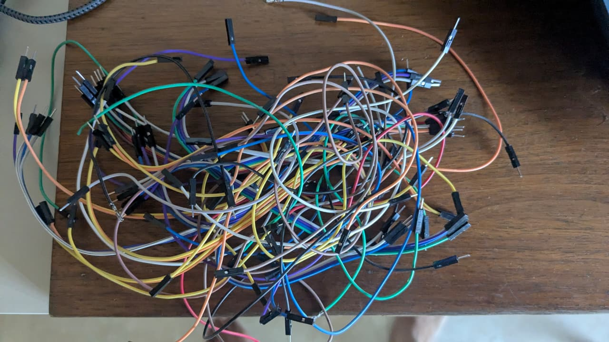

# Jumper Wires (DuPont Male-to-Male)

## Overview
You own a **large bundle of multi-colored DuPont male-to-male jumper wires**. These are the standard interconnect wires used in breadboard prototyping. They're the essential "glue" that connects all your components together during development.

## Images
- 

## Physical Specifications
| Parameter | Value |
|-----------|-------|
| **Type** | DuPont male-to-male (M-M) |
| **Pin Pitch** | 2.54mm (0.1 inch) — standard for breadboards and headers |
| **Wire Gauge** | 24–26 AWG (typical) |
| **Wire Material** | Stranded or solid tinned copper |
| **Insulation** | PVC, various colors |
| **Connector Housing** | Black plastic, 2.54mm single-pin DuPont female housing |
| **Pin** | Square/rectangular male pin, 0.64mm × 0.64mm |

## Color Inventory (Observed)
- Blue
- Green
- Yellow
- Orange
- Red
- Purple
- White
- Black
- (Possibly more colors in the bundle)

## Common Lengths
Jumper wires typically come in mixed lengths:
- **10cm** (short) — for nearby connections
- **20cm** (medium) — standard for most breadboard work
- **30cm** (long) — for spanning across the board or to external modules

## What Can You Do With These?

### 1. Breadboard Prototyping (Primary Use)
Connect components on your **solderless breadboard** (you have the 830-point board!):
- Power (red/black convention: red = VCC, black = GND, other colors = signals)
- Connect sensors, LEDs, resistors, ICs
- Connect the **ESP32** or **Arduino Uno** to external modules

### 2. Connect Microcontrollers to Modules
| Connection | Colors Convention |
|-----------|------------------|
| VCC (3.3V or 5V) | Red |
| GND | Black |
| Data/SCL/SDA | Yellow, Blue, White |
| RX/TX (serial) | Green, Orange |
| PWM / Analog | Purple, Grey |

### 3. Programming & Debugging
- Connect programmers to ICSP headers
- Attach logic analyzers or oscilloscope probes temporarily
- Create test points for multimeter measurements

### 4. Temporary Sensor Hookup
Quickly connect and disconnect sensors while testing:
- DHT22 temperature/humidity sensor
- Ultrasonic distance sensor (HC-SR04)
- PIR motion sensor
- Any I²C device (SCL/SDA + VCC/GND)

### 5. Signal Routing on Perfboards
- Use longer jumpers as a **temporary wiring harness** before soldering permanently
- Thread wires through perfboard holes for prototyped connections

### 6. Create Custom Cable Assemblies
- Combine multiple M-M wires to create ribbon-cable-like harnesses
- Use with female-to-female or male-to-female adapters (if you have any) to reach different header types

## Colour-Coding Best Practices
Using a consistent color scheme makes debugging dramatically easier:

| Purpose | Recommended Color |
|---------|------------------|
| Power (VCC) | **Red** |
| Ground (GND) | **Black** |
| I²C Clock (SCL) | **Yellow** |
| I²C Data (SDA) | **Blue** |
| Serial TX | **Green** |
| Serial RX | **Orange** |
| Digital Signals | **White, Purple, Grey** |
| Analog Signals | **Any** (document which) |

## Limitations
| Limitation | Detail |
|-----------|--------|
| **Current capacity** | ~1A max per wire (24 AWG ≈ 0.5A safe continuous) |
| **Not for permanent use** | Pins can oxidize or loosen over time |
| **No strain relief** | Pins can break off at the solder joint if bent repeatedly |
| **Signal quality** | Not suitable for high-frequency signals (>10MHz) or RF |
| **Male-to-male only** | Cannot connect directly to sensors with male headers — you'd need female-to-male wires too |

## How to Organize Them
| Method | Description |
|--------|-------------|
| **By color** | Simple but effective — use baggies or small boxes per color |
| **By length** | Group short (10cm), medium (20cm), and long (30cm) together |
| **Tie wraps** | Velcro cable ties keep the bundle from becoming a tangled mess |
| **Breadboard wire holder** | 3D-print or buy a small wire rack that sorts by color |

## What You Might Want to Buy
| Item | Reason |
|------|--------|
| **Female-to-Female (F-F) jumpers** | To connect between female headers (e.g., some sensors) |
| **Male-to-Female (M-F) jumpers** | To connect microcontrollers (male) to sensors (male) |
| **Solid core hookup wire** | Better for perfboard soldering (doesn't fray) |
| **22 AWG solid wire kit** | For permanent circuit builds on the perfboards |
| **Wire stripper** | If you plan to cut custom-length wires |
| **Breadboard wire kit** | Pre-formed, color-coded wires of precise lengths for clean breadboard layouts |

## Note
- Keep the bundle tidy — tangled jumper wires are the #1 time-waster in breadboard prototyping
- Periodically test wires with a multimeter — pins can break internally from repeated bending
- **Always unplug by the connector housing, not by pulling the wire** — this prevents pin separation