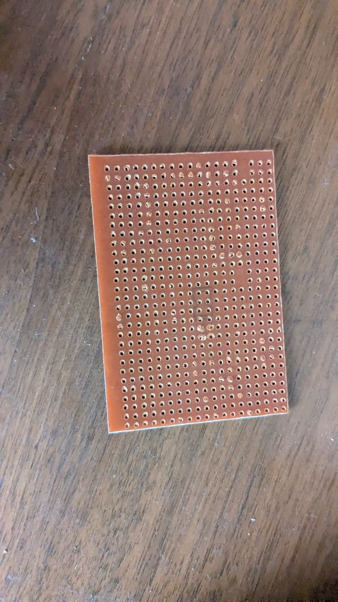
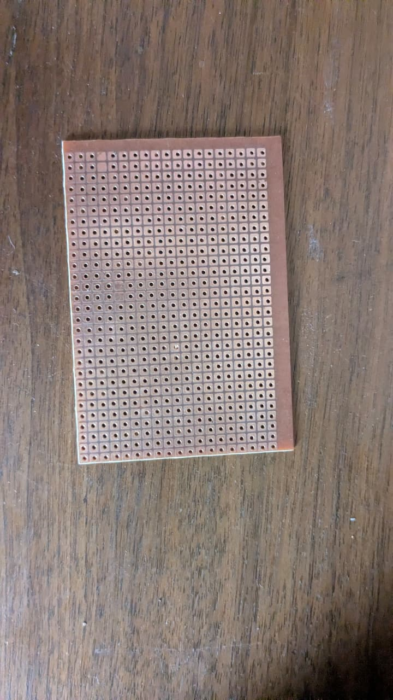

# Perfboards / Prototyping Boards

## Overview
You own **two different sizes of perfboard** (prototyping PCB). These are blank circuit boards used for soldering and testing electronic circuits. They come as a blank canvas — no copper traces — just holes at standard 2.54mm pitch for inserting components.

## Images
- 
- 

---

## Board 1 — Plain Hole Perfboard

| Parameter | Value |
|-----------|-------|
| **Image** | `perfboard-plain-holes.jpeg` |
| **Type** | Raw phenolic perfboard (no copper pads) |
| **Color** | Brown/tan (FR-2 phenolic resin paper) |
| **Hole Grid** | Approximately **18 × 24 holes** |
| **Hole Pitch** | 2.54mm (0.1 inch) — standard for all through-hole components |
| **Board Size** | ~46mm × 61mm (approx. 1.8" × 2.4") |
| **Material** | FR-2 (synthetic resin bonded paper) — cheaper than FR-4 |
| **Copper** | None — plain holes with no pads |

### What It's Best For
- Simple circuits where you solder component leads directly to each other ("dead bug" style)
- Temporary wire-wrap prototyping
- Low-frequency / low-complexity circuits
- Learning to solder (cheap and forgiving)

### Limitations
- No copper pads means the component leads alone provide the mechanical connection
- More likely to lift traces (well, there are none) when reworking
- Not ideal for surface-mount (SMD) components

---

## Board 2 — Copper Pad Perfboard

| Parameter | Value |
|-----------|-------|
| **Image** | `perfboard-copper-pads.jpeg` |
| **Type** | Single-sided copper pad perfboard (each hole has its own isolated pad) |
| **Color** | Brown/tan PCB with silver/copper square pads |
| **Hole Grid** | Approximately **24 × 31 holes** |
| **Hole Pitch** | 2.54mm (0.1 inch) |
| **Board Size** | ~61mm × 78mm (approx. 2.4" × 3.1") |
| **Material** | FR-2 phenolic with single-sided copper cladding |

### Copper Pad Details
- Each hole is surrounded by a **square copper pad**
- Pads are **not connected** to each other (unlike stripboard which has continuous copper strips)
- You create connections by **soldering component leads together** or adding jumper wires on the underside

### What It's Best For
- Permanent prototyping of **medium-complexity circuits**
- Mixing **through-hole** and some **SMD components** (with adapters)
- Circuits where each component needs an isolated connection point
- Projects that need more mechanical stability than a breadboard

---

## Common Uses for Both Boards

### 1. Permanent Circuit Assembly
Once your breadboard prototype works, transfer to perfboard and solder everything permanently. Unlike a breadboard (where wires can fall out), perfboard gives a solid, durable circuit.

### 2. Module Integration
Mount pre-built modules (ESP32, Arduino, sensor boards) onto a perfboard and wire them together. The perfboard acts as a **carrier board** with screw terminals or headers.

| Project Idea | Description |
|-------------|-------------|
| **Power Distribution Board** | Combine the XL4015 buck converter with USB outputs on one perfboard |
| **Sensor Hub** | Mount multiple sensors (DHT22, PIR, ultrasonic) with screw terminals |
| **Relay Driver Board** | Combine the Arduino + relays on perfboard for home automation |
| **Signal Conditioning** | Build op-amp filters, voltage dividers, or level shifters |

### 3. Learning & Education
- Learn soldering techniques (good joints, no bridges, proper heat application)
- Practice reading schematics and translating to physical layout
- Build classic circuits: 555 timer oscillators, transistor amplifiers, power supplies

### 4. Repair Work
- Replace a damaged PCB trace by soldering a jumper wire across perfboard holes
- Create adapter boards for non-standard components

## Perfboard vs Stripboard vs Breadboard

| Feature | Plain Perfboard | Copper Pad Perfboard | Stripboard | Breadboard |
|---------|----------------|---------------------|------------|------------|
| Connections | Solder leads directly | Solder + jumper wires | Continuous copper strips | Spring clips |
| Reusable | No (soldered) | No (soldered) | No (soldered) | Yes |
| Complexity | Low | Medium | Medium-High | Low-Medium |
| Best for | Simple circuits | Mixed circuits | Digital/analog layouts | Prototyping/testing |

## What You Can Build Right Now
You have all the parts you own at hand:

1. **Adjustable Power Supply** — Perfboard + XL4015 buck converter + screw terminals + USB outputs
2. **ESP32 Breakout Board** — Mount the ESP32 on perfboard with accessible headers for all pins
3. **Sensor Interface Board** — Bring sensor connections to screw terminals
4. **Arduino Shield** — Create custom shield that stacks on the Arduino
5. **Relay & Motor Driver Board** — Build H-bridge or relay switching circuits

## Tips
- Use **solder wick** or a **solder sucker** for mistakes
- A **third-hand tool** (helping hands) is invaluable for soldering on perfboard
- Plan your component layout on paper before soldering
- Use **IC sockets** for chips so they're replaceable
- For the copper pad board, you can also use **wire-wrap** instead of solder