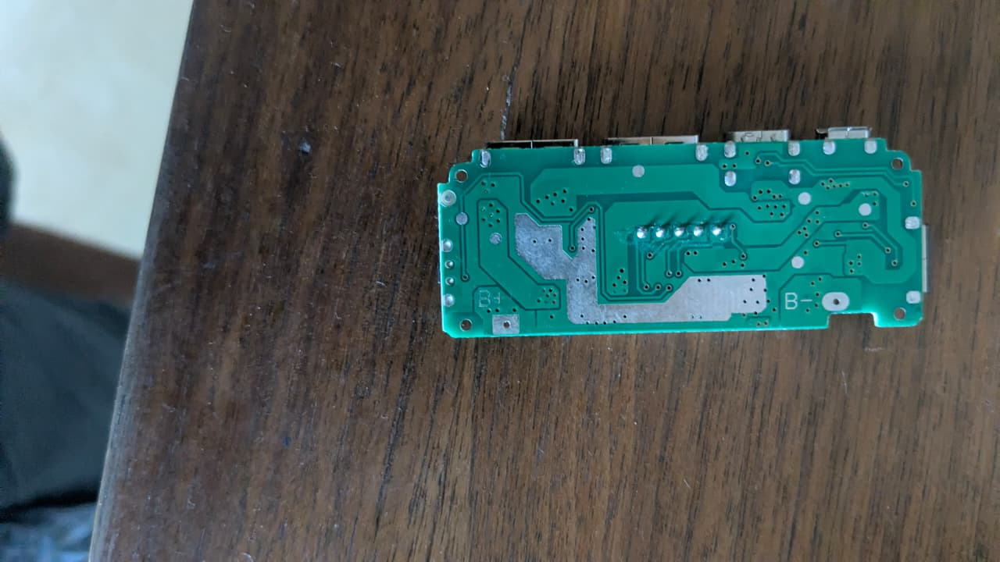

# Power Bank Control Board (Dual USB Charging Module)

## Overview
You own a **generic power bank mainboard** — the control PCB that goes inside a portable power bank / battery pack. It manages charging Lithium-ion batteries from USB input and boosting battery voltage to 5V USB output. It has two USB-A output ports, one USB-C port, and one Micro-USB input port.

## Images
- 

## Physical Specifications
| Parameter | Value |
|-----------|-------|
| **PCB Color** | Green solder mask |
| **Form Factor** | Rectangular board for 2× 18650 cell power bank |
| **Ports** | 2× USB-A (output), 1× USB-C (bidirectional), 1× Micro-USB (input) |

## Ports & Connectors
| Port | Function | Specifications |
|------|----------|----------------|
| **USB-A (x2)** | Output — charge phones/tablets | 5V, up to 2.4A each (shared) |
| **USB-C** | Bidirectional — charge the power bank OR charge devices | 5V input/output |
| **Micro-USB** | Input only — charge the power bank | 5V, up to 2A |
| **B+ / B-** | Solder pads for Li-ion battery (18650 cells) | See battery section below |

## Battery Connection
| Pad | Connection |
|-----|-----------|
| **B+** | Positive terminal of the battery pack |
| **B-** | Negative terminal of the battery pack |

- Designed for a **2S (two-cell series) or parallel** configuration of 18650 Lithium-ion cells
- Most common: **parallel (2P)** configuration — both batteries positive to B+, both negative to B-
- Battery voltage range: **3.0V–4.2V** per cell (Li-ion)

## Visible Components (Bottom Side)
| Component | Description |
|-----------|-------------|
| **Thick copper traces** | Designed for high current (1A–2.4A) heat dissipation |
| **B+/B- pads** | Large solder pads for battery wire attachment |
| **5-pin header** | Connects to the LCD or LED indicator board on the other side |
| **Large vias** | Thermal vias for heat transfer between board layers |

## What Can You Do With This?

### 1. Build a DIY Power Bank
This is the **main board for a power bank**. To build a working unit, you need:

| Component | Details |
|-----------|---------|
| **Li-ion batteries** | 1 or 2 × **18650 cells** (you'll need to buy these) |
| **Enclosure** | 3D-printed case or recycled power bank shell |
| **Wiring** | Thick (~20 AWG) wires from battery to B+/B- |
| **Soldering** | Solder wires to B+ and B- pads |

### 2. Upgrade an Existing Power Bank
- If an existing power bank has a dead board, this can replace it
- Add this board to a project box with external battery connections

### 3. USB Power Supply Project
- Combine with the **XL4015 buck converter** to create a bench power supply with USB output
- Use as a **regulated 5V supply** for Arduino/ESP32 projects from battery power

### 4. Repair / Salvage
- If you have 18650 cells from old laptop batteries, test them and pair with this board
- Use the USB-C port for **modern charging convenience** alongside the Micro-USB

## Electrical Specifications (Typical)
| Parameter | Value |
|-----------|-------|
| Input (Micro-USB) | 5V DC, up to 2A |
| Input (USB-C) | 5V DC, up to 2A |
| Output (USB-A each) | 5V DC, up to 2.4A (shared total ~2.4A max) |
| Battery Charging Current | ~1A (typical) |
| Boost Converter Efficiency | ~85–93% |
| Standby Current | ~50–100µA |
| Protection | Overcharge, overdischarge, short circuit, reverse polarity |

## What You DON'T Have (Need to Buy)
- **18650 Lithium-ion batteries** (protected, high-drain recommended) — 2× for full capacity
- **Battery holder** or spot welder for nickel strips
- **Enclosure** (3D print or project box)
- **Thick wire** (20–22 AWG) for battery to board connections
- **Heat shrink tubing** for insulation

## Build Notes
- **Battery safety:** Always use **protected** 18650 cells. Never mix old and new batteries. Never charge unattended.
- **Soldering to batteries:** Prefer a **battery holder** or **spot welder** over direct soldering (heat can damage Li-ion cells)
- **Test first:** Before putting in an enclosure, test the board by connecting a USB cable to Micro-USB — the LCD/LED should light up
- **USB-C cable:** Use a **USB-C to USB-C cable** if you want bidirectional charging