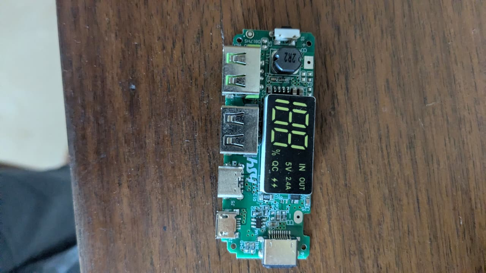

# Power Bank Module with LCD Display (HSY)

## Overview
You own a **power bank mainboard with an integrated LCD display** branded "HSY". This is a more advanced power bank control module that includes a **digital battery percentage display**, multiple charging standards support (including Quick Charge), and dual USB output ports. It's the brain of a DIY or replacement power bank.

## Images
- 

## Physical Description
| Feature | Details |
|---------|---------|
| **PCB Color** | Green solder mask |
| **Brand Mark** | "HSY" printed in white on the board |
| **Display** | **LCD screen** showing battery percentage |
| **Display Indicators** | Percentage (0–100%), IN/OUT, 5V 2.4A, QC (Quick Charge), lightning bolt icons |
| **Tactile Switch** | White button (top right) — wakes display / toggles power output |

## Ports & Connectors
| Port | Location | Function |
|------|----------|----------|
| **USB-A (x2)** | Left side, top | Output — charge devices |
| **USB-C** | Left side, center | Bidirectional — charge power bank OR charge devices |
| **Micro-USB** | Left side, bottom | Input only — charge the power bank |
| **B+ / B-** | Right edge | Solder pads for Li-ion battery connection |

## Key Components (Top Side)
| Component | Label/Marking | Function |
|-----------|---------------|----------|
| **Power Inductor** | "2R2" (black, circular) | 2.2µH — energy storage for boost converter |
| **Main Controller IC** | Near bottom center (unmarked) | Charging logic, battery protection, display driver |
| **Tactile Switch** | White push button | Wake display / toggle output |
| **SMD Resistors** | R40, R41, R60, etc. | Current sensing, voltage dividers |
| **SMD Capacitors** | Various (C-series) | Filtering and decoupling |
| **LCD Display** | Top right | Shows battery percentage and charging status |

## LCD Display Icons
| Icon | Meaning |
|------|---------|
| **100%** (number) | Current battery charge level |
| **IN** | Power bank is being charged (input active) |
| **OUT** | Power bank is discharging (powering a device) |
| **5V 2.4A** | Standard output rating |
| **QC** | Quick Charge protocol supported (Qualcomm Quick Charge 2.0/3.0) |
| **⚡ (bolt)** | Fast charging active |

## Electrical Specifications (Typical)
| Parameter | Value |
|-----------|-------|
| **Input (Micro-USB)** | 5V DC, up to 2A |
| **Input (USB-C)** | 5V DC, up to 2A |
| **Output (USB-A)** | 5V DC, 2.4A each (shared) |
| **Quick Charge Output** | QC 2.0/3.0: 5V/9V/12V (compatible devices) |
| **Battery Type** | 1S or 2S Li-ion (18650 cells) |
| **Battery Charging Current** | ~1–2A |
| **Standby Current** | ~50µA |
| **Protection Features** | Overcharge (>4.25V cutoff), overdischarge (<2.9V cutoff), short circuit, overcurrent |

## What Can You Do With This?

### 1. Build a Premium DIY Power Bank
This is the core of a **featured power bank** with percentage display and QC charging.

**You'll need to add:**
- 1 or 2 × **18650 Li-ion cells** (protected)
- Enclosure (3D-printed case or repurposed shell)
- Wires for battery connections

### 2. Battery Capacity Tester / Monitor
- Use the LCD display to check the charge level of 18650 cells
- Test salvaged laptop batteries for remaining capacity

### 3. Embedded Power Supply with Display
- Integrate into a project box as a **portable power supply** with battery level readout
- Combine with the **XL4015 buck converter** for adjustable voltage + USB output + battery display

### 4. Bench Power Supply Display
- The LCD percentage display can sense battery voltage — useful for monitoring battery state in ongoing projects

### 5. Retrofit / Repair
- Replace a broken power bank board with this more capable version
- Upgrade an old power bank (no display) to one with LCD + QC

## Build Notes

### Battery Connection
```
18650 Cell 1 (+) ────┐
                      ├─── B+ (on board)
18650 Cell 2 (+) ────┘
                      
18650 Cell 1 (-) ────┐
                      ├─── B- (on board)
18650 Cell 2 (-) ────┘
```
- **Parallel configuration** recommended (same voltage, double capacity)
- **Do NOT** use series (2S) unless the board explicitly supports it — 2S would give 7.4V which may damage the 5V-boosted charging circuit

### Quick Charge Notes
- QC (Quick Charge) only works with **QC-compatible devices** (most modern Android phones)
- The board negotiates QC voltage (5V/9V/12V) via the USB D+/D- lines
- iPhones will charge at standard 5V 2.4A (not QC)
- USB-C may support **Power Delivery (PD)** if the chip supports it — test with a USB-C device

## Known Issues / Limitations
- Some HSY boards have inaccurate percentage reading below 10% (the chip's voltage-to-percentage mapping is non-linear)
- If the display shows 100% constantly, the battery voltage reference may be offset — cycle the battery fully a few times
- Do not exceed the board's rated current — the boost converter can overheat

## What You Need to Buy
- **18650 Li-ion cells** (Samsung 30Q, LG MJ1, or Panasonic NCR18650B recommended)
- **Battery holder** (spring-loaded 18650 holder) or spot welder + nickel strips
- **22 AWG silicone wire** for battery connections
- **Enclosure** (project box or 3D-print a power bank case)
- **Toggle switch** (optional, for cutting battery power when not in use)