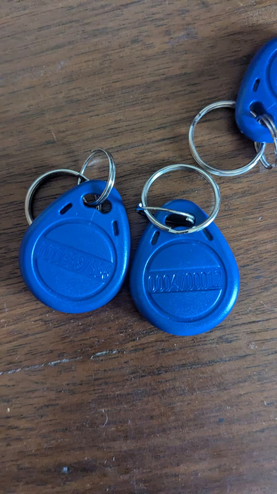
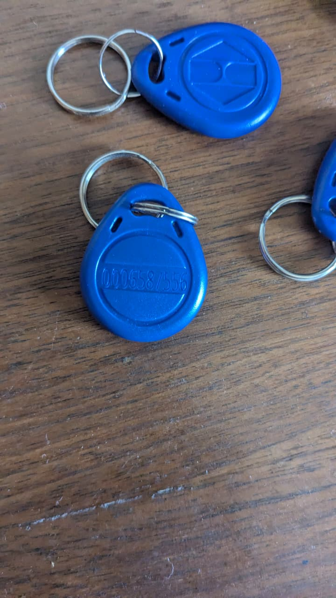
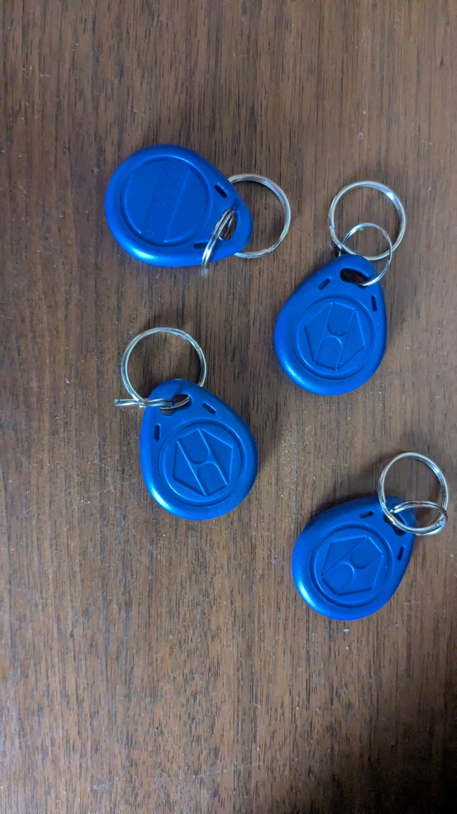

# RFID Key Fobs (Blue, 125kHz)

## Overview
You own **multiple blue teardrop-shaped RFID key fobs** operating at **125kHz Low Frequency (LF)**. These are passive proximity tags used for contactless access control systems. They contain no battery — they are powered by the electromagnetic field emitted by an RFID reader.

## Quantity
- **At least 7 fobs** across multiple images (some identical, some with different markings)

## Images
- 
- 
- 

## Physical Specifications
- **Shape:** Teardrop / rounded rectangular with a circular face
- **Material:** Injection-molded blue ABS plastic
- **Keyring:** Each has a silver metal split ring for attaching to keychains
- **Dimensions:** ~40mm × 30mm × 5mm (typical)
- **Weight:** ~5g each

## Technical Specifications
| Parameter | Value |
|-----------|-------|
| **Frequency** | 125 kHz (Low Frequency / LF) |
| **Protocol** | EM4100 / EM4102 (most common), read-only |
| **Chip Type** | Likely EM4100, EM4200, or T5577 (if rewritable) |
| **Read Range** | 3–10 cm (depends on reader power) |
| **Power Source** | Passive (powered by reader's RF field) |
| **Water Resistance** | Fully sealed, splash-proof |
| **Operating Temperature** | -20°C to +50°C |

## Internal Components (Sealed Inside)
1. **RFID IC** — Tiny silicon chip storing the unique ID number; powered via inductive coupling
2. **Copper Antenna Coil** — Multi-turn wire coil around the perimeter of the fob; receives energy and transmits data
3. **Resonating Capacitor** — Tunes the antenna to 125kHz for optimal power transfer

## Markings Observed
| Fob | Marking |
|-----|---------|
| Fob 1 (logo side) | Hexagonal "H/hourglass" logo (generic manufacturer mold) |
| Fob 2 | Embossed: `0006587556` (10-digit decimal UID) |
| Fob 3 | Embossed: `0004700012` (10-digit decimal UID) |
| Others | No visible markings (blank/unprinted) |

Note: The printed number is **not necessarily the internal chip UID** — some fobs have the UID printed, others use a different numbering system. A reader is needed to confirm the actual electronic serial number.

## What Can You Do With These?

### 1. Access Control (Original Purpose)
- Clone/program for apartment gates, office doors, gym lockers, parking barriers
- Program with compatible 125kHz RFID writer/cloner (e.g., T5577 programmer, Proxmark3, RC522 with Arduino)

### 2. DIY RFID Projects
- **Arduino/ESP32 Reader:** Interface with RC522 (not 125kHz compatible — need RDM6300 or RDM8800) or RDM6300 module to read fob IDs
- **Attendance System:** Build a logging system that reads fob IDs on entry
- **Smart Lock:** Combine with a relay and solenoid lock for RFID-based door unlocking
- **Pet Door:** Train a selective pet door that responds to a specific fob

### 3. Security Testing & Learning
- Use a **Proxmark3** for RFID security research — cloning, sniffing, bruteforcing
- Learn about LF RFID protocols (EM4100 format: 64-bit, 9+10+32+4+1 structure)
- Understand facility codes vs card numbers in 26-bit Wiegand format

### 4. Projects Requiring Short-Range Identification
- Key cabinet management
- Tool checkout system
- Membership cards for a garage-based "makerspace"

## What You'll Need to Buy (If Using These)
| Need | Suggested Purchase |
|------|-------------------|
| Read these fobs with microcontroller | **RDM6300 or RDM8800** 125kHz RFID reader module |
| Clone/write new IDs | **T5577 rewriteable tags** + USB RFID writer |
| Advanced RFID hacking | **Proxmark3 Easy** or **Proxmark RDV4** |
| Arduino/ESP32 to interface | Any Arduino or ESP32 dev board (you already have both!) |

## Notes
- These are **125kHz LF** fobs — they are NOT compatible with **13.56MHz HF** readers (MIFARE/NFC). You cannot read them with a smartphone NFC app (phones use 13.56MHz).
- The EM4100 protocol uses a 64-bit data stream: 9 header bits + 10 DIP bits + 32 data bits + 4 parity bits + 1 stop bit
- 125kHz has longer range through materials than 13.56MHz but lower data rate
- If some fobs appear blank/unmarked, they may still have a pre-programmed UID — test with a reader
