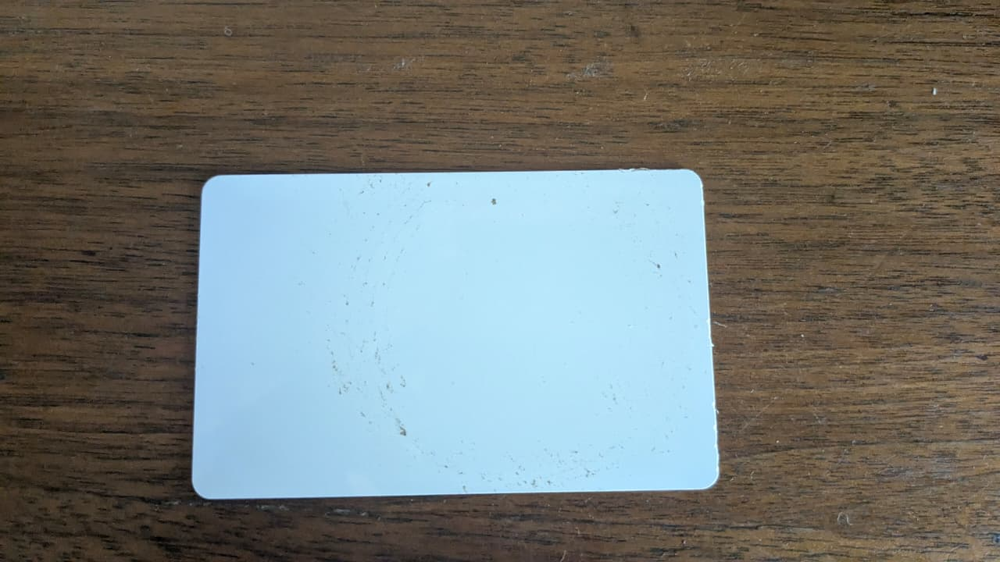
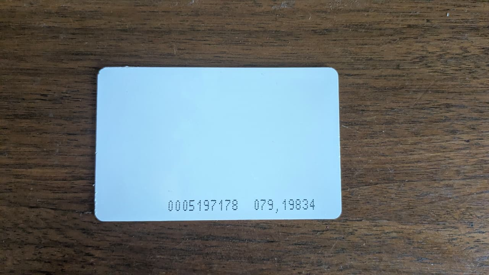

# RFID / NFC Proximity Cards (White)

## Overview
You own **two white rectangular RFID proximity cards** — one completely blank and one with a printed ID number. These are passive 125kHz proximity cards used for access control systems, similar to the blue key fobs but in a credit-card form factor.

## Images
- 
- 

## Physical Specifications
| Parameter | Value |
|-----------|-------|
| **Form Factor** | CR80 (ISO/IEC 7810 ID-1) |
| **Dimensions** | 85.60mm × 53.98mm × 0.76mm |
| **Material** | White PVC plastic (printable surface) |
| **Rounded Corners** | Yes |

## Technical Specifications
| Parameter | Value |
|-----------|-------|
| **Frequency** | Most likely **125 kHz** (LF) — standard proximity card |
| **Protocol** | HID Prox (H10301 26-bit format) or EM4100 compatible |
| **Chip Type** | HID or generic EM4100/EM4200 (sealed inside) |
| **Read Range** | 5–15 cm |
| **Power Source** | Passive (no battery) |

## Card Details

### Card 1 — Blank White Card
- **Image:** `rfid-card-blank.jpeg`
- No visible markings, text, or logos
- Has a faint circular residue (possibly from a factory sticker)
- Could be: **MIFARE Classic 1K/4K** (13.56MHz), **NTAG21x** (NFC), or **125kHz prox** — requires a reader to determine
- Blank PVC cards are also sold as **printable cards** for ID badge printers

### Card 2 — Numbered White Card
- **Image:** `rfid-card-numbered.jpeg`
- Printed in dot-matrix style: **`0005197178 079,19834`**
  - **0005197178** — The raw decimal ID often printed for human reference
  - **079** — Facility Code / Site Code (identifies which building or organization)
  - **19834** — Card Number / User ID (identifies the individual)
- This numbering matches the **26-bit Wiegand H10301 format** (HID Prox standard)
- **Not an NFC card** — these are classic 125kHz proximity cards

## Internal Construction
Inside the plastic layers:
1. **Antenna Coil** — Fine copper wire wound around the card perimeter (several turns)
2. **RFID IC** — Tiny silicon die bonded to the antenna; stores the unique facility code + card number
3. **Lamination** — The chip and antenna are sandwiched between PVC layers via heat/pressure

## What Can You Do With These?

### 1. Access Control Emulation
- Read the card ID with a 125kHz reader
- Program a **blue key fob** (you already have those) with the same ID as a backup
- Use for: building access, parking gates, time clocks

### 2. Clone to Other Formats
- Copy the card ID to a **T5577 rewritable tag**, key fob, or wristband
- Useful if the card is assigned to you and you want a smaller keychain version

### 3. Blank Card Projects
- The blank card can be:
  - Used as a **printable ID badge** (thermal transfer printer)
  - Written with a new ID if it contains a **T5577** or **MIFARE** chip (needs reader verification)
  - Embedded in a custom project (glued inside a phone case, etc.)

### 4. RFID Security Learning
- Understand the **Wiegand 26-bit protocol** structure:
  - Parity bit 1 (even) + 8-bit Facility Code + 16-bit Card Number + Parity bit 2 (odd)
  - Facility Code 079 (decimal) = `01001111` binary
  - Card Number 19834 (decimal) = `0100110101111010` binary
- Use with **Proxmark3** to analyze the raw bitstream

### 5. Physical Security
- Combine with an **Arduino + RDM6300** reader + **relay + solenoid** for a DIY access control system
- Log entry/exit times with an ESP32 sending data over Wi-Fi

## What You'll Need to Buy

| Need | Suggested Component |
|------|-------------------|
| Read card's actual chip type | **PN532** (reads both 125kHz and 13.56MHz) or **RDM6300** (125kHz only) |
| Clone the card | **T5577 rewritable tag** + USB 125kHz programmer |
| NFC-capable card reader | **PN532** or **RC522** (13.56MHz only) |
| Determine if blank card is NFC | Use any **NFC-enabled smartphone** with "NFC TagInfo" app |

## Notes
- These cards are **typically read-only** (factory programmed). Only rewritable variants (T5577) can be modified.
- The blank card might support **NFC (13.56MHz)** if it's a MIFARE/NTAG type — test with your phone.
- 26-bit Wiegand is the most common format but other bit-lengths exist (32-bit, 34-bit, 37-bit, etc.)
- **Do NOT** cut or drill the card — it will destroy the antenna coil and make it unusable