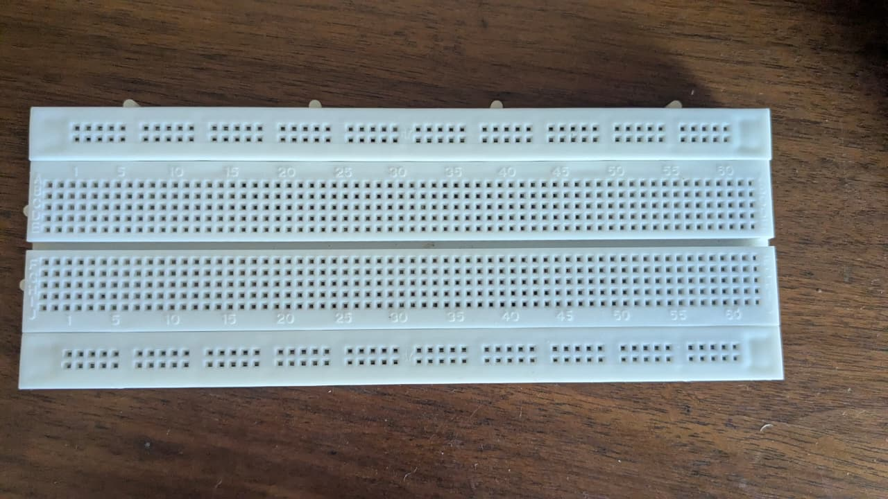

# Solderless Breadboard (830 Tie-Points)

## Overview
You own a **standard 830 tie-point solderless breadboard** (MB-102 style). This is the fundamental tool for electronics prototyping — it lets you build and test circuits without soldering. Components and jumper wires plug directly into the spring-clip holes.

## Images
- 

## Physical Specifications
| Parameter | Value |
|-----------|-------|
| **Model** | MB-102 (standard 830-point) |
| **Dimensions** | ~16.5cm × 5.5cm × 0.85cm |
| **Material** | White ABS plastic body |
| **Contact Material** | Nickel-plated phosphor bronze spring clips |
| **Hole Pitch** | 2.54mm (0.1 inch) |
| **Accepts Wire** | 20–29 AWG (0.3–0.8mm diameter) |
| **Interlocking** | Tabs and notches on edges — multiple boards can snap together |

## Layout & Internal Connectivity

### Terminal Strips (Center Area)
```
  ┌────┬────┬────┬────┬────┬────┬────┬────┬────┬────┬────┬────┬────┬────┐
  │ 1  │ 2  │ 3  │ 4  │ 5  │... │ 10 │... │ 15 │... │ 20 │... │ 60 │ 61 │
A ├────┼────┼────┼────┼────┼────┼────┼────┼────┼────┼────┼────┼────┼────┤
B ├────┼────┼────┼────┼────┼────┼────┼────┼────┼────┼────┼────┼────┼────┤
C ├────┼────┼────┼────┼────┼────┼────┼────┼────┼────┼────┼────┼────┼────┤
D ├────┼────┼────┼────┼────┼────┼────┼────┼────┼────┼────┼────┼────┼────┤
E ├────┼────┼────┼────┼────┼────┼────┼────┼────┼────┼────┼────┼────┼────┤
  │    │    │    │    │    │    │    │    │    │    │    │    │    │    │
  │ ←─── CENTER NOTCH (for DIP ICs) ────→                           │    │
  │    │    │    │    │    │    │    │    │    │    │    │    │    │    │
F ├────┼────┼────┼────┼────┼────┼────┼────┼────┼────┼────┼────┼────┼────┤
G ├────┼────┼────┼────┼────┼────┼────┼────┼────┼────┼────┼────┼────┼────┤
H ├────┼────┼────┼────┼────┼────┼────┼────┼────┼────┼────┼────┼────┼────┤
I ├────┼────┼────┼────┼────┼────┼────┼────┼────┼────┼────┼────┼────┼────┤
J ├────┼────┼────┼────┼────┼────┼────┼────┼────┼────┼────┼────┼────┼────┤
  └────┴────┴────┴────┴────┴────┴────┴────┴────┴────┴────┴────┴────┴────┘
```

| Connection Rule | Explanation |
|----------------|-------------|
| **Vertical columns** | A–E in the same column number (e.g., 1A through 1E) are all connected |
| **Vertical columns** | F–J in the same column number (e.g., 11F through 11J) are all connected |
| **Center notch** | **No connection** across the notch. DIP ICs straddle this gap |
| **Adjacent columns** | **NOT connected** — e.g., column 1 and column 2 are isolated |
| **Power rails (top)** | Connected in horizontal segments (typically broken every 5–10 holes on some models) |

### Power Rails
- **Top row:** Red stripe (+) and Blue/Black stripe (-) — use for VCC and GND
- **Bottom row:** Same pattern — useful for a second voltage or additional ground
- **NOTE:** Some MB-102 breadboards have **split power rails** (broken in the middle). Always verify continuity with a multimeter and bridge if needed

## Tie-Point Count
| Section | Count |
|---------|-------|
| Terminal strips (63 columns × 10 rows) | 630 points |
| Power rails (top: 2 × ~50) | ~100 points |
| Power rails (bottom: 2 × ~50) | ~100 points |
| **Total** | **~830 points** |

## What Can You Do With This?

### 1. Prototype Circuits (Primary Use)
Build and test circuits before soldering onto perfboard:
- **LED + resistor** test circuits
- Transistor amplifier stages
- Op-amp circuits (555 timer, LM358, etc.)
- Sensor interfaces (DHT22, PIR, ultrasonic)

### 2. Microcontroller Development
Plug in your **Arduino Uno** or **ESP32** directly:
```
ESP32 / Arduino → plug into breadboard edges (if pins fit)
                  OR connect via jumper wires
```
Then add sensors, displays, relays, and power components around it.

### 3. Learn Electronics
The breadboard is the best tool for learning:
- Follow tutorials that use breadboard layouts
- Experiment with different resistor/capacitor values
- Try circuit variations without committing to solder

### 4. I²C / SPI / UART Communication Testing
- Connect multiple I²C devices on the same bus
- Test SPI communication between Arduino and peripherals
- Debug serial (UART) connections

### 5. Temporary Sensor Testing
Quickly test sensors before integrating into a permanent build:
| Sensor | Connections |
|--------|------------|
| DHT22 | VCC, GND, Data (1 pin) |
| HC-SR04 | VCC, GND, Trig, Echo (4 pins) |
| PIR Sensor | VCC, GND, OUT (3 pins) |
| I²C (any) | VCC, GND, SCL, SDA (4 pins) |

## Breadboard Tips

### DOs
- Use **jumper wires** of appropriate length — keep it tidy
- Follow a consistent color convention (Red=VCC, Black=GND)
- Use **22 AWG solid-core wire** for best fit in the holes
- Verify connections with a **multimeter** in continuity mode
- Push components firmly until they bottom out

### DON'Ts
- Don't use stranded wire — it can crush the spring clips
- Don't exceed **5V** on standard breadboards (some can't handle high voltage)
- Don't leave the board in direct sunlight (UV yellows the plastic)
- Don't use excessively thick component leads (>0.8mm)

## Projects You Can Build Right Now
With just the breadboard + ESP32/Arduino + sensors from your collection:

1. **Blinking LED** — Hello World of electronics
2. **Temperature/Humidity Monitor** — DHT22 + LCD display
3. **Ultrasonic Distance Sensor** — HC-SR04 + buzzer/LED
4. **Wi-Fi Smart Switch** — ESP32 + relay module
5. **RFID Door Lock Simulator** — RFID reader + servo/LED indicator
6. **PWM LED Dimmer** — Potentiometer + LED
7. **Power Supply Tester** — XL4015 output to breadboard with load resistors

## What You Might Want to Buy
| Item | Use |
|------|-----|
| **Half-size breadboard** | For smaller projects (400 or 300 points) |
| **Breadboard power supply module** | Provides regulated 3.3V and 5V from a single DC input |
| **Pre-formed breadboard wires** | Precisely cut and bent for clean layouts |
| **Header pin strips** | To connect modules without jumper wires |
| **Second full-size breadboard** | Snap together for larger circuits |
| **Breadboard jumpers kit** | Assorted lengths in organized packaging |