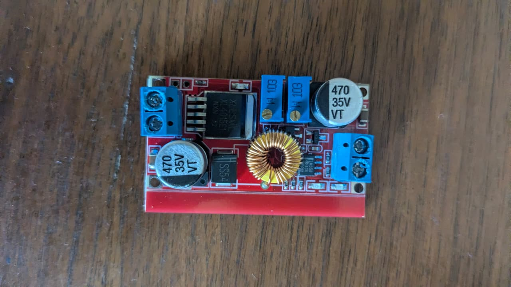
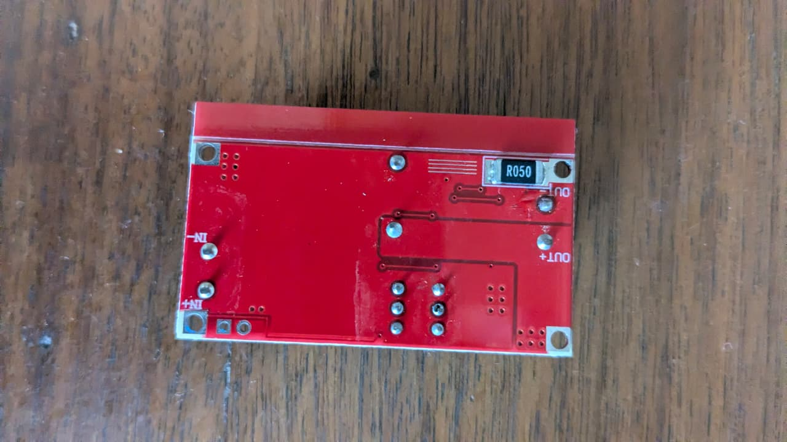

# XL4015 / XL4016 DC-DC Buck Converter Module

## Overview
You own a **DC-DC step-down (buck) converter module** based on the **XL4015E1 chip** (with a matching XL4016 bottom-side board). This module takes a higher DC input voltage and efficiently converts it to a lower, **adjustable output voltage** — with **constant voltage (CV)** and **constant current (CC)** regulation. It's essentially an adjustable bench power supply in a compact module.

## Images
- 
- 

## Core Specifications (XL4015)
| Parameter | Value |
|-----------|-------|
| **Chip** | XL4015E1 (XLSEMI) |
| **Input Voltage** | 8V – 36V DC |
| **Output Voltage** | 1.25V – 32V DC (adjustable) |
| **Output Current** | 0A – 5A (adjustable, continuous) |
| **Output Power** | Up to 75W (with adequate heatsinking) |
| **Switching Frequency** | 180 kHz (fixed) |
| **Efficiency** | Up to 96% (depending on ∆V and load) |
| **Output Ripple** | < 50 mV (typical) |
| **Load Regulation** | ±0.5% |
| **Line Regulation** | ±0.5% |

## Board Components (Top Side)

| Component | Marking | Function |
|-----------|---------|----------|
| **XL4015E1 IC** | `XLESEMI XL4015E1 NXN 32` | Main PWM buck switching regulator |
| **Toroidal Inductor** | Large copper-wound coil | Energy storage — smooths current flow |
| **Electrolytic Capacitors (x2)** | `470 35V VT` | 470µF, 35V — input and output filtering |
| **Schottky Diode** | `SS54` | 5A, 40V — freewheeling diode for buck circuit |
| **Potentiometer (Voltage)** | `W 103` (blue, 10kΩ) | Adjusts output voltage (1.25–32V) |
| **Potentiometer (Current)** | `W 103` (blue, 10kΩ) | Adjusts output current limit (0–5A) |
| **LM358 Op-Amp** | 8-pin IC | Dual operational amplifier — handles CC (constant current) feedback |
| **LEDs** | Small SMD LEDs | Charging / Full-charge indicator (if used as battery charger) |

## Board Components (Bottom Side)

| Component | Marking | Function |
|-----------|---------|----------|
| **Current Sense Resistor** | `R050` | 0.050Ω (50 mΩ) — measures output current for CC regulation |
| **Screw Terminals (IN)** | None visible | Input: IN+ and IN- |
| **Screw Terminals (OUT)** | None visible | Output: OUT+ and OUT- |
| **Thick copper traces** | For high current | Designed to handle 5A+ without overheating |

## Adjustment Procedure

### Set Output Voltage
1. Turn the **voltage pot** (use a multimeter on the output)
2. Clockwise = increase voltage, Counter-clockwise = decrease voltage
3. Range: 1.25V to 32V (with input at least 3V above desired output)

### Set Output Current Limit
1. Short the output (connect OUT+ to OUT- via multimeter in current mode, or via a load resistor)
2. Turn the **current pot** while observing the current reading
3. Set to the desired limit (e.g., 1A for LED, 2A for battery charging)
4. The CC LED will light when the circuit is in constant-current mode

## Input / Output Connection
```
Power Source (8-36V DC)        Load (Device)
     │                              │
     ▼                              ▼
┌─────────────────────────────────────────┐
│   IN+ ────║══════════════║──── OUT+    │
│   IN- ────║══════════════║──── OUT-    │
└─────────────────────────────────────────┘
```

## What Can You Do With This?

### 1. Adjustable Bench Power Supply
- Connect a **12V laptop power brick or AC-DC adapter** to the input
- Get a variable 1.25V–32V output for powering your circuits
- Useful for testing motors, LEDs, sensors at different voltages

| Input Source | Output Range | Max Current |
|-------------|--------------|------------|
| 12V lead-acid battery | 1.25V – 11V | 5A |
| 19V laptop charger | 1.25V – 17V | 5A |
| 24V power supply | 1.25V – 22V | 3A (limited by power dissipation) |
| 36V solar panel | 1.25V – 32V | 2A |

### 2. High-Power LED Driver
**Perfect for:** driving high-brightness LEDs that need constant current:
- Set the current limit to match the LED's rated current
- Set the voltage limit to the LED's forward voltage
- The module auto-regulates in CC mode

| LED Type | Forward Voltage | Set Current |
|----------|----------------|------------|
| 1W LED | ~3.2V | 350mA |
| 3W LED | ~3.6V | 700mA |
| 10W COB LED | ~10V | 1000mA |
| LED strip | 12V | Depends on length |

### 3. Li-Ion / Lead-Acid Battery Charger
Use the **constant current + constant voltage** (CV/CC) feature:
1. Set output voltage to battery's full charge voltage
2. Set current limit to safe charging current (e.g., 0.5C for Li-ion)
3. Connect battery: module will CC charge first, then CV top-off

| Battery | Full Voltage | Safe Current (1S) |
|---------|-------------|-------------------|
| 1S Li-ion (1 cell) | 4.2V | 1A (for 2000mAh cell) |
| 2S Li-ion | 8.4V | 1A |
| 3S Li-ion | 12.6V | 1A |
| 6V Lead-acid | 7.2V | 500mA |
| 12V Lead-acid | 14.4V | 1–2A |

### 4. General-Purpose Voltage Regulator
- Drop 12V to 5V for powering Arduino/ESP32 from a car battery
- Drop 24V to 12V for powering fans, pumps, or LED strips
- Drop 36V to 3.3V for low-power sensor circuits

### 5. Lab / Workshop Tool
- Use as a **variable voltage supply** for prototyping
- Feed the output into your **breadboard** (with proper bypass caps)
- Combine with your **power bank boards** for a complete power solution

## Efficiency Guide
| Input → Output | Efficiency | Heat |
|---------------|-----------|------|
| 12V → 5V | ~92% | Low |
| 12V → 3.3V | ~88% | Moderate |
| 24V → 12V | ~95% | Low |
| 24V → 5V | ~85% | Moderate |
| 36V → 5V | ~75% | High |

## Important Warnings

| ⚠️ Warning | Detail |
|-----------|--------|
| **Minimum load required?** | Some XL4015 modules need a small load (~10mA) to regulate properly |
| **Heat dissipation** | At high ∆V and high current, the module gets hot — add a fan or heatsink |
| **Input voltage must exceed output** | Buck converter requires Vin > Vout + 2V minimum |
| **Reverse polarity protection** | This board does NOT have it — triple-check connections |
| **No short circuit protection** | The CC limiting helps, but don't leave output shorted indefinitely |
| **Capacitive loads** | Large capacitors on output can cause startup into CC mode — pre-charge if needed |
| **LED indicators** | Don't rely on LEDs for precise reading — always use a multimeter |

## What You Might Want to Buy
| Item | Use |
|------|-----|
| **Heatsink** (aluminum, TO-220 style) | Attach to XL4015 chip for better heat dissipation |
| **12V / 24V power supply** | Input source (laptop charger works well) |
| **Multimeter** | For setting voltage and current limits |
| **Screw terminals** | If the ones on the module are missing or damaged |
| **Enclosure / project box** | To make a safe bench power supply |
| **Binding posts** | For 4mm banana plug outputs on the front panel |
| **Voltmeter / ammeter display** | Small digital panel meter for real-time readout |