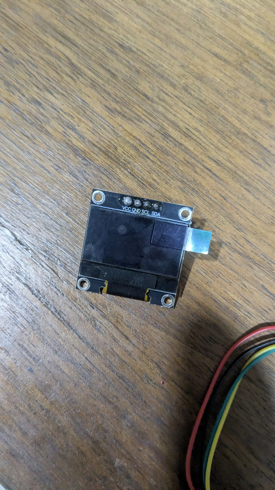
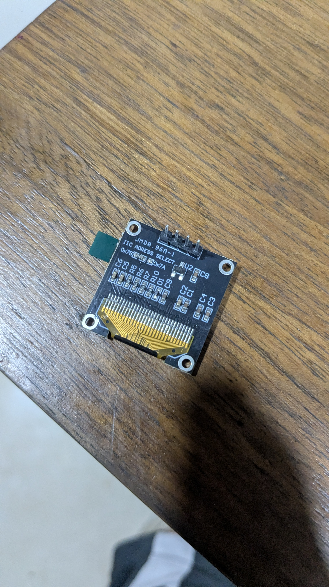
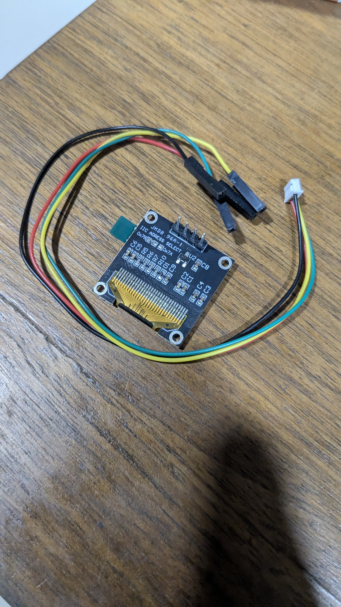
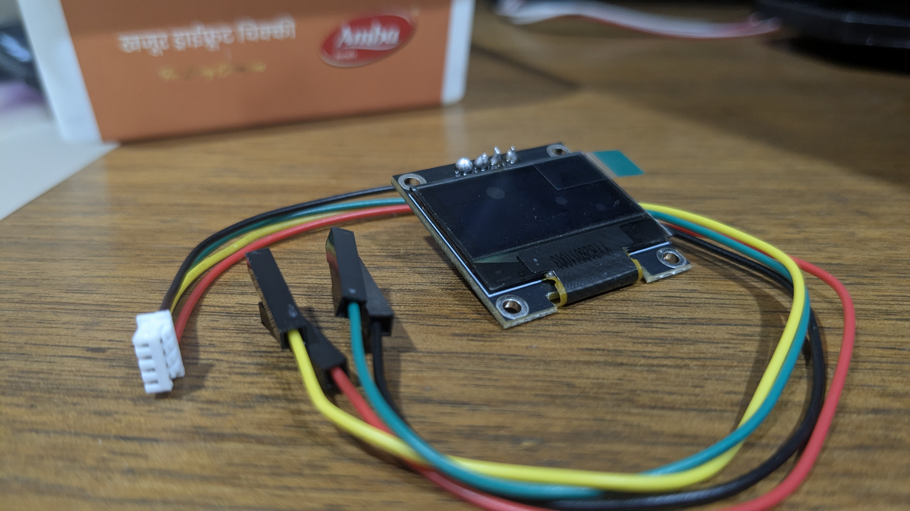

# I2C 0.96 inch OLED Display Module

## Overview
This component is an **I2C 0.96-inch monochrome OLED display screen** that came with your Evelta Pixhawk 2.4.8 combo kit. It connects to the shared I2C bus and provides real-time telemetry diagnostics directly on the drone itself. This allows you to inspect battery levels, flight modes, GPS satellite counts, and pre-arm errors on the bench without having a laptop or your GCS web dashboard connected.

## Images
- **Display Front:** 
- **Display Back:** 
- **OLED with Cable (Back):** 
- **OLED with Cable (Front):** 

## Physical Specifications
| Parameter | Value |
|-----------|-------|
| **Screen Size** | 0.96 inches (diagonal) |
| **Resolution** | 128 × 64 pixels |
| **Display Technology** | OLED (Self-luminous, no backlight needed) |
| **Driver Chip** | SSD1306 (Monochrome) |
| **Interface** | I2C (Inter-Integrated Circuit) |
| **Default 7-Bit Address** | `0x3C` (often silkscreened as `0x78` for 8-bit write addresses) |
| **Operating Voltage** | 3.3V to 5.0V |
| **Current Consumption** | ~20mA (typical, depends on screen lit percentage) |

---

## Pinout Definitions

The OLED display features a 4-pin header labeled at the top of the board:

| Pin | Label | Color (Standard Cable) | Description |
|-----|-------|-----------------------|-------------|
| **1** | **VCC** | Red | Power Input (3.3V or 5.0V from I2C bus) |
| **2** | **GND** | Black | System Ground Reference |
| **3** | **SCL** | Green (or Blue) | I2C Serial Clock Line |
| **4** | **SDA** | Yellow | I2C Serial Data Line |

---

## Connection & Wiring Scheme

Since the Pixhawk only has one physical I2C port, the OLED display shares the bus with your GPS Compass and RGB LED using the **I2C Splitter Board**:

```
                              ┌──────────────────┐
                              │  Pixhawk 2.4.8   │
                              └────────┬─────────┘
                                       │ (I2C Port)
                              ┌────────▼─────────┐
                              │   I2C Splitter   │
                              └──┬───┬───────┬───┘
                                 │   │       │
            ┌────────────────────┘   │       └─────────────────────┐
            ▼                        ▼                             ▼
    [Neo-M8N Compass]        [RGB LED Module]             [OLED Display Module]
    (Address: `0x1E`)       (Address: `0x55`)             (Address: `0x3C`)
```

*   **Wiring:** Connect the 4-pin female JST/DF13 end of the cable into the I2C Splitter Board. Plug the individual female DuPont pins on the other end to the OLED header matching `VCC`, `GND`, `SCL`, and `SDA`.

---

## Common Uses in the Skylink Ecosystem

### 1. Bench Telemetry Inspection
Before launching the GCS web dashboard, you can read diagnostic parameters directly from the screen:
*   **Arming Status:** Displays `DISARMED` or `ARMED`.
*   **Flight Mode:** Shows the active mode (e.g., `STABILIZE`, `LOITER`, `GUIDED`, `RTL`).
*   **Battery Status:** Displays battery voltage and remaining capacity percentage.
*   **GPS Status:** Shows satellite lock status and number of satellites.

### 2. Troubleshooting Pre-Arm Failures
If the Pixhawk prevents you from arming the motors (e.g., red flashing LED), the OLED screen will display the exact error message (such as `PreArm: Compass not calibrated` or `PreArm: Unhealthy AHRS`), making debugging much faster on the bench.

---

## Configuration & Parameter Tuning (Mission Planner)

To enable the OLED display to print ArduPilot telemetry, you must configure the display parameter in Mission Planner:

1. Connect the Pixhawk via USB.
2. Go to **Config** $\rightarrow$ **Full Parameter List**.
3. Search for the display parameter depending on your ArduCopter firmware version:
   * **For Copter 3.6.x (your version):** Search for **`NTF_DISPLAY_TYPE`**
   * **For Copter 4.x+:** Search for **`DISPLAY_TYPE`**
4. Set the value to **`1`** (which enables the SSD1306 OLED driver).
5. Click **Write Params** on the right side.
6. **Reboot the Pixhawk** to initialize the display. The screen will turn on and display the ArduPilot logo, followed by the live status screen.

---

## Safety & Mounting Advice
*   **Fragile Screen:** The OLED display glass is thin and has no protective bezel. Avoid mounting it in locations where it can take direct impact during a hard landing or crash.
*   **Insulation:** The back of the module has exposed solder joints. Ensure it is mounted on a non-conductive surface (use double-sided foam tape) to avoid shorting against the carbon fiber or fiberglass plates of the drone frame.
