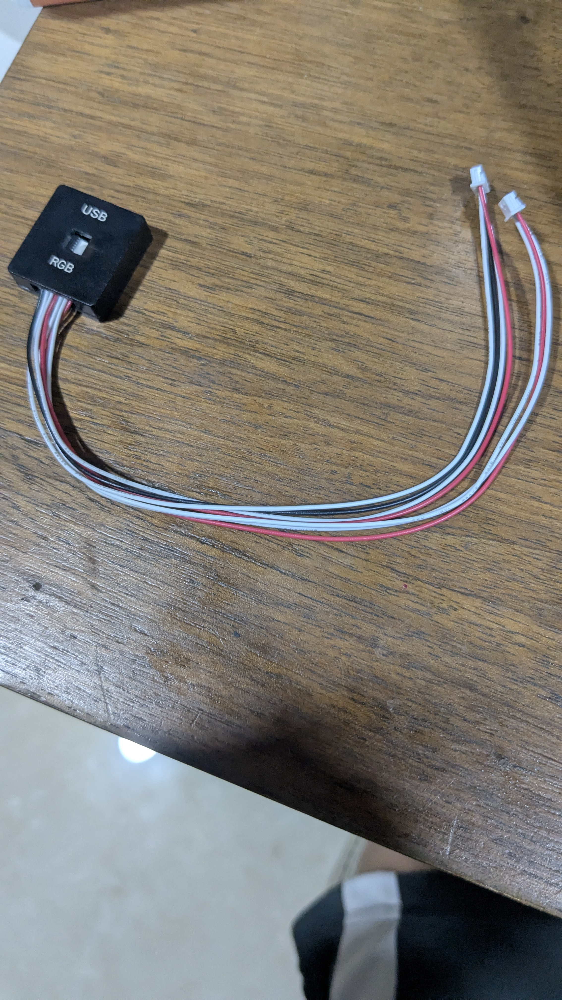
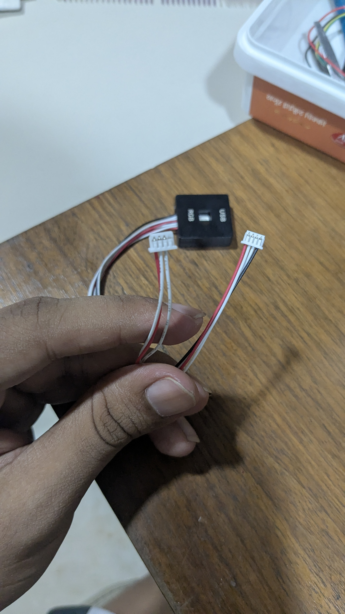

# Pixhawk External USB & LED Module

## Overview
This component is an **external USB and LED extension board** that came with your Evelta Pixhawk 2.4.8 kit. It is designed to mount the flight controller's micro-USB port and multicolor RGB status LED on the exterior of the drone's chassis. Because the Pixhawk is often buried deep in the center of the frame under wires and battery straps, this module makes it easy to connect a laptop or check flight status at a glance.

## Images
- **Front View:** 
- **Connectors View:** 

## Physical Specifications
| Parameter | Value |
|-----------|-------|
| **USB Connector** | Female Micro-USB (for laptop data connection) |
| **LED Type** | High-brightness RGB LED |
| **LED Driver Chip** | Toshiba LED (NCP5623C or equivalent, I2C address `0x55`) |
| **Input Connectors** | 1x 4-pin (I2C/RGB) and 1x 5-pin (USB) JST/DF13 connectors |
| **Logic Voltage** | 3.3V / 5.0V (powered by Pixhawk internal buses) |
| **Mounting** | 2x mounting holes for screws/zip-ties on frame arms |

---

## Connection & Wiring Scheme

The module connects to two separate ports on the Pixhawk flight controller using the integrated ribbon cable:

```
┌─────────────────────────────────┐                 ┌──────────────────────┐
│  External USB & LED Module      │                 │    Pixhawk 2.4.8     │
├─────────────────────────────────┤                 ├──────────────────────┤
│  5-Pin Connector (USB Data)    ◄┼────────────────►│  USB Port (Side)     │
│  4-Pin Connector (I2C RGB LED) ◄┼────────────────►│  I2C Splitter / Port │
└─────────────────────────────────┘                 └──────────────────────┘
```

1. **USB Link (5-pin connector):** Plugs into the micro-USB socket on the side of the Pixhawk. This extends the serial port for connecting Mission Planner on your laptop.
2. **LED Link (4-pin connector):** Plugs into the I2C splitter board. This carries the power and I2C commands (`SDA`, `SCL`, `VCC`, `GND`) to drive the multicolor status LED.

---

## Common Uses in the Skylink Ecosystem

### 1. External Mission Planner Connection
When you need to adjust parameters, calibrate the compass, or download flight logs, you can plug your micro-USB cable directly into this module without having to reach inside the drone frame.

### 2. Visual Flight Status Diagnostics
The external RGB LED mirrors the internal LED of the Pixhawk. It communicates the current autopilot state using standardized color codes, which are vital for verifying safety before committing to a Skylink internet-guided flight:
* **Flashing Blue:** Powered on, no GPS lock (waiting for satellites before click-to-fly).
* **Flashing Green:** 3D GPS lock acquired (ready to fly, location visible on Skylink map).
* **Solid Green/Blue:** Armed (motors are running/live).
* **Flashing Yellow:** Failsafe triggered (battery low or GCS link lost).
* **Flashing Red:** Pre-arm safety check failed (must check GCS dashboard for details).

---

## Configuration & Parameter Tuning

The RGB LED controller utilizes the standard Toshiba I2C protocol. By default, ArduPilot is pre-configured to drive this LED. 

If the LED does not light up upon boot:
1. Connect the Pixhawk to Mission Planner.
2. Navigate to **Config** $\rightarrow$ **Full Parameter List**.
3. Search for **`NTF_LED_TYPES`**.
4. Ensure the parameter is set to include the Toshiba LED bit (typically set to **`199`**).
5. Write the parameters and power-cycle the board.

---

## Safety & Care Instructions
* **Delicate Wires:** The ribbon cables are thin and prone to tearing if caught in propellers or pulled during a crash. Secure the wires along the drone arms using zip-ties.
* **Orientation:** Make sure the connectors are fully seated in the Pixhawk ports. If plugged in backwards or forced into the wrong port, it can temporarily short-circuit the I2C bus and cause the Pixhawk to report an "Unhealthy Sensors" error.
