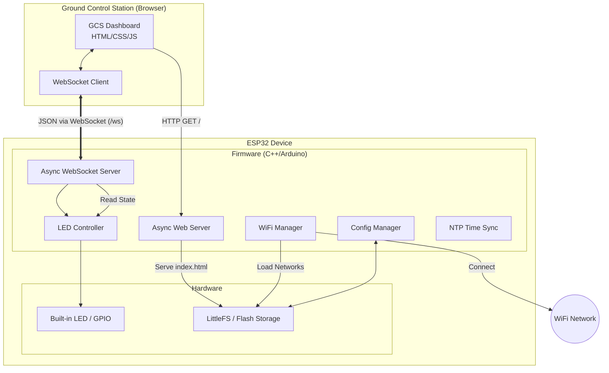

# System Architecture

This diagram illustrates the high-level architecture of the Skylink ESP32 IoT Platform, showing the relationship between the hardware, the firmware modules, and the user interface.

## Description

1. **GCS Dashboard**: A premium dark-themed web interface served directly from the ESP32.
2. **WebSocket Channel**: Provides real-time, bi-directional telemetry and command delivery.
3. **Firmware Modules**: Decoupled modules handling specific tasks (WiFi, Web, Hardware Control).
4. **LittleFS**: Used to store `index.html`, `wifi_networks.json`, and other static assets.
