# Communication Sequence

This diagram shows the sequence of messages between the GCS Dashboard and the ESP32 for command execution and telemetry streaming.

```mermaid
sequenceDiagram
    participant UI as GCS Dashboard (JS)
    participant WS as WebSocket Handler (ESP32)
    participant HW as LED Controller (Hardware)

    Note over UI, WS: WebSocket Handshake (HTTP 101)

    UI->>WS: { "type": "command", "command": "PING" }
    WS-->>UI: { "type": "event", "event": "PONG", "timestamp": ... }

    rect rgb(20, 30, 40)
        Note right of UI: User clicks "LED ON"
        UI->>WS: { "type": "command", "command": "LED_SET", "value": true }
        WS->>HW: Turn LED ON
        HW-->>WS: State: ON
        WS-->>UI: { "type": "event", "event": "LED_STATE", "value": true }
    end

    loop Every 3 Seconds
        WS->>WS: Read Internal Sensors
        WS-->>UI: { "type": "event", "event": "HEARTBEAT", "altitude": 12.4, "battery": 85, ... }
        Note left of UI: UI Updates Gauges & Log
    end

    rect rgb(40, 20, 20)
        Note right of WS: Connection Lost
        WS-xUI: [TCP Close]
        UI->>UI: Show "Disconnected" Overlay
        UI->>UI: Attempt Reconnect (Backoff)
    end
```

## Protocol Details
- **Transport**: WebSockets (`ws://<ip>/ws`)
- **Format**: JSON
- **Latency**: Sub-200ms (Local via AsyncTCP)
