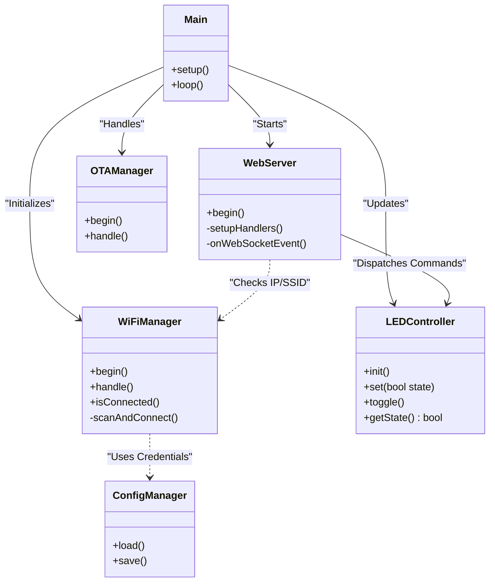

# Firmware Component Diagram

A breakdown of the modular C++ architecture used in the Skylink ESP32 firmware.

## Module Responsibilities
- **Main**: Orchestrates boot sequence and periodic tasks.
- **WiFiManager**: Manages the life-cycle of the wireless connection.
- **WebServer**: Handles asynchronous HTTP requests and WebSocket frames.
- **LEDController**: Hardware abstraction layer for actuators.
- **ConfigManager**: Interface for non-volatile storage (LittleFS/Preferences).
