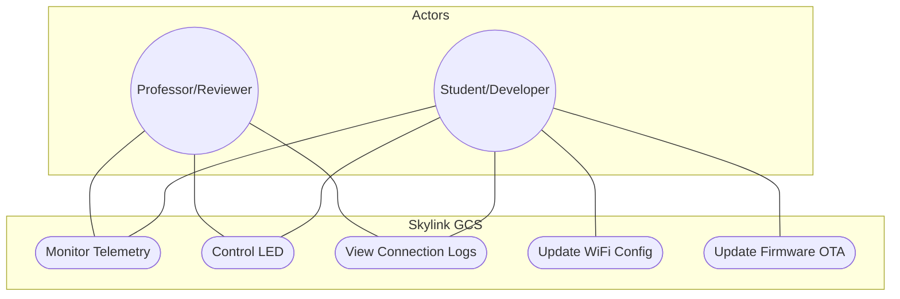

# Use Cases

This diagram outlines the primary ways a user interacts with the Skylink system.

## Interactions
1. **Monitor Telemetry**: Viewing live altitude, battery, and GPS data streams.
2. **Control LED**: Sending real-time commands to toggle physical hardware.
3. **View Connection Logs**: Auditing the JSON message exchange for debugging.
4. **Update WiFi Config**: Managing network credentials via the dashboard.
5. **OTA Update**: Deploying new firmware code over the network.
