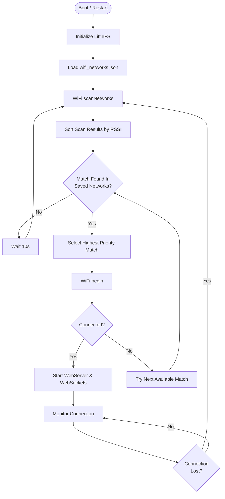

# WiFi Connection Flow

The Skylink platform uses a "Scan-and-Match" logic to identify and connect to the best available WiFi network without hardcoding credentials in the source code.

## Key Features
- **Priority Based**: Connects to the primary network if available, otherwise falls back.
- **Dynamic Config**: New networks can be added by updating `wifi_networks.json` via LittleFS.
- **Fail-safe**: Retries indefinitely if no known network is found.
